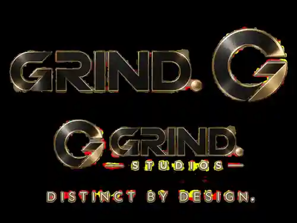
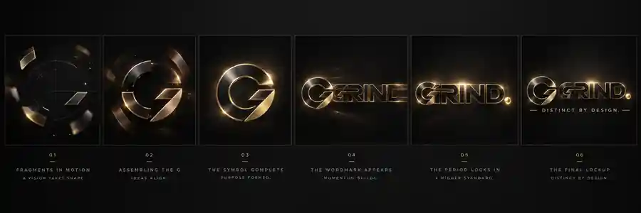

<p align="center">
  
</p>

<h1 align="center">BLACK MARKET</h1>

<p align="center"><strong>A premium auction-house slot concept by GRIND.</strong></p>

<p align="center">
  <a href="https://raw.githack.com/Bahrain-AI/black-market-slot/main/demo/index.html"><strong>▶ PLAY THE PUBLIC DEMO</strong></a>
</p>

<p align="center">
  <strong>RARE ITEMS. BIGGER STORIES.</strong><br/>
  Stake Engine-ready frontend · Svelte 5 · Vite · Responsive · RGS integration scaffold
</p>

---

## Overview

**BLACK MARKET** is a luxury underground-auction slot built around rare objects, escalating bids and high-stakes presentation. The visual language combines black marble, smoked glass, champagne gold and gallery lighting with a restrained premium interface.

This repository contains the playable frontend, a zero-build public demo, GRIND. provider branding, Stake Engine integration layer, submission notes and the foundation for the production math package.

> **Current status:** frontend/integration prototype. The final certified math package and production RTP are still pending validation and simulation.

## Play it

**Live audience demo:** https://raw.githack.com/Bahrain-AI/black-market-slot/main/demo/index.html

The public demo is intentionally separated from the production Stake Engine path. It uses virtual credits and local demo outcomes only so visitors can experience the visual direction and interaction without an RGS session.

> **Visual rebuild in progress:** the current live demo still uses the earlier presentation. The next task is the 1:1 rebuild against the supplied luxury-auction reference. See [`HANDOFF.md`](HANDOFF.md) for exact continuation notes, reference-grid coordinates, controls, acceptance criteria and terminal commands.

## GRIND. — provider identity

<p align="center">
  
</p>

**Provider:** Grind Studios  
**Consumer brand:** **GRIND.**  
**Tagline:** **Distinct by Design.**

The complete working brand kit is in [`branding/`](branding/):

- [`BRAND.md`](branding/BRAND.md) — brand system, usage and animation direction
- [`grind-mark.webp`](branding/grind-mark.webp) — standalone broken-G symbol
- [`grind-logo-sheet.webp`](branding/grind-logo-sheet.webp) — logo/lockup reference
- [`grind-logo-animation-storyboard.webp`](branding/grind-logo-animation-storyboard.webp) — six-stage reveal storyboard
- [`black-market-cover.webp`](branding/black-market-cover.webp) — current game cover direction

## Game direction

- Premium 5×4 slot presentation
- Luxury underground-auction theme
- WILD substitution
- Responsive desktop/mobile/popout layout
- Keyboard spin support
- Turbo UI support
- RGS-controlled balance, currency and bet levels
- Replay-mode support
- Local assets only; no runtime CDN dependency

Planned signature systems include **Bid War**, **Steal or Sell**, and **The Vault** bonus structure. These mechanics remain subject to final math balancing and approval.

## Stake Engine integration

The frontend is structured for Stake Engine launch parameters and wallet communication, including:

- `sessionID`
- `rgs_url`
- `lang`
- `device`
- `/wallet/authenticate`
- `/wallet/play`
- `/wallet/end-round`
- replay query parameters and `/bet/replay/...`
- jurisdiction-aware Turbo visibility

See [`stake-engine/README.md`](stake-engine/README.md) and [`stake-engine/submission-checklist.md`](stake-engine/submission-checklist.md).

## Tech stack

- **Svelte 5**
- **Vite**
- **TypeScript / JavaScript**
- Static production build
- Stake Engine RGS integration scaffold

## Local development

```bash
nvm use
npm i -g pnpm@10.5.0
pnpm install
pnpm dev
```

Without Engine launch parameters, the app runs in a clearly separated local demo mode for frontend development. Production sessions are intended to obtain outcomes from the RGS.

For the zero-build audience demo only:

```bash
python3 -m http.server 8080
```

Then open `http://localhost:8080/demo/`.

## Production build

```bash
pnpm build
```

The resulting `dist/` directory is the static frontend bundle intended for deployment/submission.

## Math status

The production math package is intentionally **not fabricated**. Stake Engine requires verified static outcome books and weighted lookup tables.

See [`math/README.md`](math/README.md).

Before submission we still need to:

1. Finish the actual game math model.
2. Run large-scale simulations for each production mode.
3. Optimize and verify RTP / volatility / max-win behavior.
4. Generate final weighted lookup tables and outcome books.
5. Replace provisional rules/paytable copy with verified production values.
6. Complete final staging, mobile and replay QA.

## Brand previews

<p align="center">
  
</p>

## Repository structure

```text
HANDOFF.md       continuation notes for the 1:1 browser-demo rebuild
branding/        GRIND. identity + BLACK MARKET cover assets
demo/            zero-build public audience demo
math/            math package notes / production math work
src/             Svelte application source
stake-engine/    Engine integration + submission checklist
assets/          game art and symbols
```

## Disclaimer

This project is in active development and is **not yet a certified or production-approved gambling product**. Final gameplay probabilities, RTP, paytable values and release assets must be validated before submission or public wagering use.

---

<p align="center"><strong>BLACK MARKET — by GRIND.</strong><br/>Distinct by Design.</p>